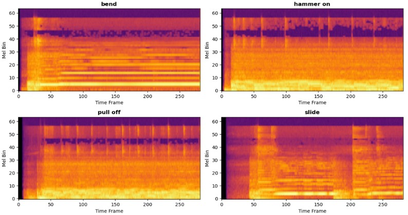
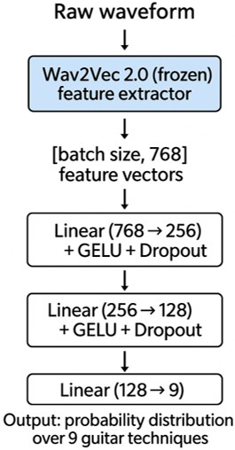
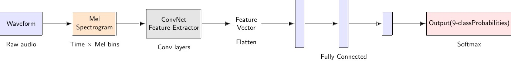
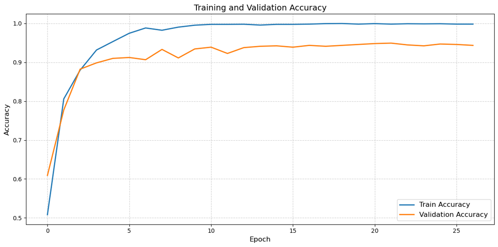
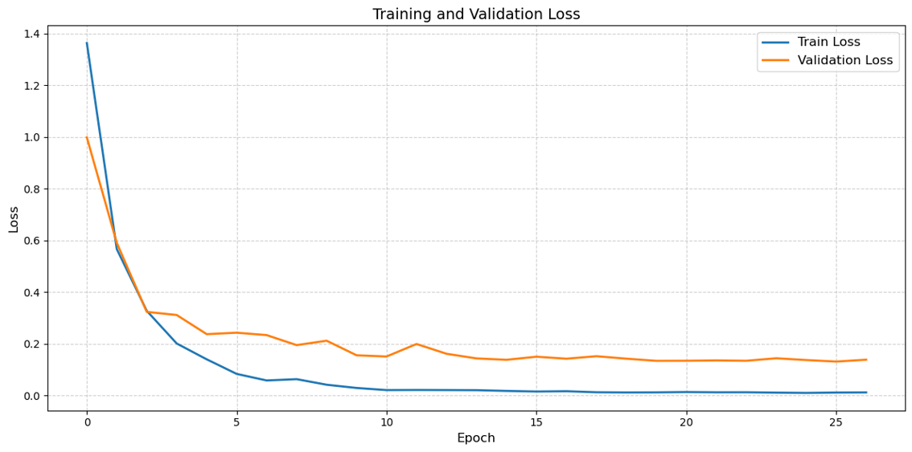
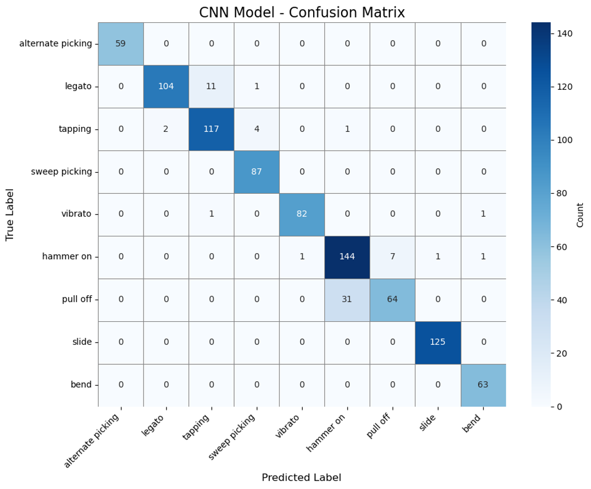
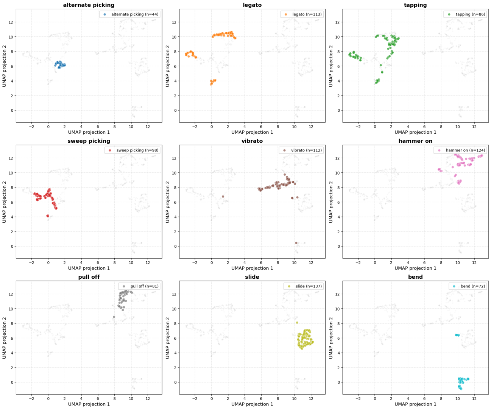

**Status:** Completed course project  
**Keywords:** machine learning, audio signal processing

This project explores whether electric guitar playing techniques can be recognized automatically from audio. The goal was to support music education, transcription, and performance analysis.

We worked with a dataset covering 9 common electric guitar techniques: alternate picking, legato, tapping, sweep picking, vibrato, hammer-on, pull-off, slide, and bend. Two learning pipelines were compared: a transfer-learning route using wav2vec 2.0 embeddings with an MLP classifier, and a vision-based route using Mel-spectrograms with ConvNetworks.

## Methodology

<!--  -->

<!--  -->

To improve robustness, we used pitch-shift augmentation to balance the dataset and on-the-fly augmentations such as gain variation and additive noise. The models were trained with a 6:2:2 train/validation/test split, cross-entropy loss, AdamW optimization, on-the-fly learning rate adjustion, and early stopping.

## Results

The Mel-spectrogram + ConvNet pipeline achieved a Top-1 accuracy of 93%, outperforming the wav2vec + MLP route, which reached 65%. The main errors came from acoustically similar techniques, especially hammer-on versus pull-off, and some confusion between legato and tapping. Overall, the results show that guitar techniques can be recognized effectively from time-frequency audio representations, while pretrained speech models can still provide useful features for non-speech audio classification tasks.
